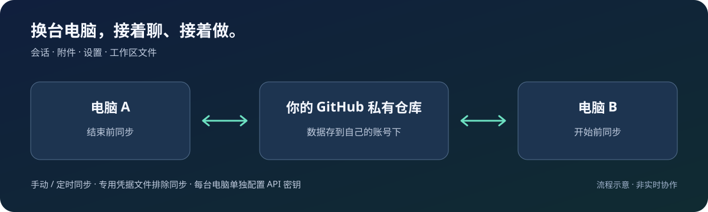

<div align="center">

# DSH Sync

### 换台电脑，接着聊、接着做。

把 [DeepSeek Harness][dsh] 的**会话、附件、设置和工作区文件**同步到其他电脑。
数据存放在你自己的 [GitHub 私有仓库][private-repo]，支持手动与自动同步。

[](https://www.npmjs.com/package/dsh-sync-plugin)
[](LICENSE)

[🚀 开始使用](#开始使用) · [💻 接入另一台电脑](#接入另一台电脑) · [🛠 遇到问题](#遇到问题) · [English](README.en.md)

</div>

## 开始使用

**已经能打开 [DSH Web][dsh]？先检查下面的工具，再安装插件。** 全新电脑可以跟着[完整安装指南](docs/getting-started.md#环境准备)走。

| 需要准备 | 用来做什么 | 去哪里获取 |
| --- | --- | --- |
| [DSH Web][dsh] | 插件运行的地方，使用 `web` profile | [官方安装说明][dsh] |
| [Node.js][node] | 运行环境，建议使用 24 | [下载安装][node] |
| [Git][git] | 上传、下载与保存版本 | [下载安装][git] |
| [GitHub 账号][github] + [GitHub CLI][gh] | 登录账号，创建或连接私有仓库 | [注册账号][signup] · [安装 CLI][gh] |

### 1. 装上插件

在运行 [DSH][dsh] 的电脑上打开终端，执行：

```sh
dsh plugin --profile web add dsh-sync-plugin
```

### 2. 登录同步账号

使用 [GitHub CLI][gh] 登录，在提示中选择 **[GitHub.com][github] → HTTPS**：

```sh
gh auth login
gh auth status
```

看到已登录的账号后，重启 [DSH][dsh]。卡在登录？看[官方登录帮助][login]。

### 3. 点一下「⟳ 同步」

首次同步前，先到 **设置 → 同步 → 同步偏好** 确认范围：**工作区文件默认也会上传**；只想带走会话、附件与设置，就关闭「同步工作区文件」。

然后点侧栏的 **「⟳ 同步」**。你可以选择：

| 你的情况 | 怎么连接 |
| --- | --- |
| 第一次用，还没有同步仓库 | 保留默认选项。插件会尝试在已登录账号下创建或复用私有仓库，默认名为 `dsh-sync` |
| 已有同步仓库，或想自己选择仓库 | 在 **设置 → 同步 → 连接同步仓库** 填入地址与分支，保存后再同步；[新建私有仓库][new-repo] · [详细步骤](docs/getting-started.md#手动连接仓库) |

**怎样才算成功？** 设置页显示目标仓库和同步结果，且没有工作区失败。看到「本地快照」只代表保存在本机，还没有上传；[查看解决方法](docs/getting-started.md#常见问题)。

## 接入另一台电脑

**同一套工具，同一个仓库，就能接上。** 每台新增电脑都按下面的步骤操作：

1. 按[上面的准备清单](#开始使用)安装工具和插件，使用 [GitHub CLI][gh] 登录能访问同步仓库的账号。
2. 在 **设置 → 同步 → 连接同步仓库** 填写与原电脑一致的**仓库地址和分支**，保存。同账号使用默认仓库时，也可以让插件自动复用。
3. 原电脑先同步，新电脑再同步。完成后重启新电脑上的 [DSH][dsh]，加载取回的会话与设置。
4. 配置这台电脑的 API 密钥，按需安装插件和项目依赖。工作区路径需要调整时，在同步结果里点「换位置」。[查看恢复说明与检查表](docs/getting-started.md#第二台电脑)

不需要先手动克隆数据目录。新电脑已有的内容也会参与双向合并；保存仓库地址本身不会开始传输。

## 日常使用：开工接上，收工存好

**开始前同步，结束后同步。** 切换设备前，确认上一台的改动已经上传。

想少点几次按钮？在 **设置 → 同步 → 同步偏好** 选择「自动同步」并保存，立即生效。默认每 5 分钟同步，也会响应会话活动。自动同步仍需要应用运行、网络可用；离开前可以手动同步一次确认结果。

## 行李清单：哪些一起走？

| 会带走 | 需要在各机处理 |
| --- | --- |
| 会话、附件及工作区对应关系 | API 密钥：专用凭据文件 `.credentials.yaml` 不同步 |
| 工作区实际文件，可关闭 | 项目依赖与缓存：`node_modules` 等不传输 |
| 模型与界面设置、插件清单 | 插件依赖需要安装；工作区路径可在本机调整 |
| 你提供的托管补丁 | 补丁是否适用，取决于目标文件内容 |

会话、附件和项目文件中仍可能包含敏感信息，上传前请检查[同步范围与排除规则](docs/sync-content.md)。同步也会传播删除与错误修改，重要资料请保留独立备份。

<details>
<summary>想了解同步流程、冲突处理和兼容范围？</summary>



支持的会话和配置会尝试自动合并；普通文件冲突可能保留本机版本，并尝试备份远端历史。具体结果请看同步详情和[合并与恢复边界](docs/sync-content.md#合并与恢复边界)。适合个人多台设备交替使用。

- 宿主声明：[DSH Web][dsh] ≥ `0.1.5-rc.3`。
- 运行环境：[Node.js][node] ≥20；建议 24，压缩会话处理需要 Zstandard 支持。
- 云端传输：[Git][git]、已登录的 [GitHub CLI][gh]，以及能访问 [GitHub][github] 的网络。
- 测试覆盖与尚未验证的组合见[验证记录](docs/release-0.12.5-validation.md)，不代表所有系统和宿主版本均已实测。

</details>

## 遇到问题

| 卡在哪里 | 直接去这里 |
| --- | --- |
| 安装后找不到同步按钮 | [检查安装位置、重启与加载](docs/getting-started.md#环境准备) |
| 登录失败 / 只有本地快照 | [账号登录帮助][login] · [连接与排障](docs/getting-started.md#常见问题) |
| 新电脑找不到原来的会话 | [换机步骤与检查表](docs/getting-started.md#第二台电脑) |
| 网络不通 / 需要代理 | [代理与配置参考](docs/configuration.md) |
| 想排除文件 / 不上传整个项目 | [同步范围与排除规则](docs/sync-content.md) |
| 仍然没解决 | [提交问题](https://github.com/dpskk2/dsh-sync-plugin/issues/new/choose)，附版本、步骤和脱敏错误 |

## 更新与更多资料

```sh
dsh plugin --profile web update dsh-sync-plugin
```

更新后重启 [DSH][dsh]。[查看更新记录](CHANGELOG.md) · [完整使用指南](docs/getting-started.md) · [配置参考](docs/configuration.md) · [开发与验证](CONTRIBUTING.md) · [npm 安装包](https://www.npmjs.com/package/dsh-sync-plugin)

[dsh]: https://github.com/deepseek-ai/deepseek-harness
[node]: https://nodejs.org/en/download
[git]: https://git-scm.com/downloads/
[github]: https://github.com/
[signup]: https://github.com/signup
[gh]: https://cli.github.com/
[login]: https://cli.github.com/manual/gh_auth_login
[new-repo]: https://github.com/new
[private-repo]: https://docs.github.com/en/repositories/creating-and-managing-repositories/about-repositories
